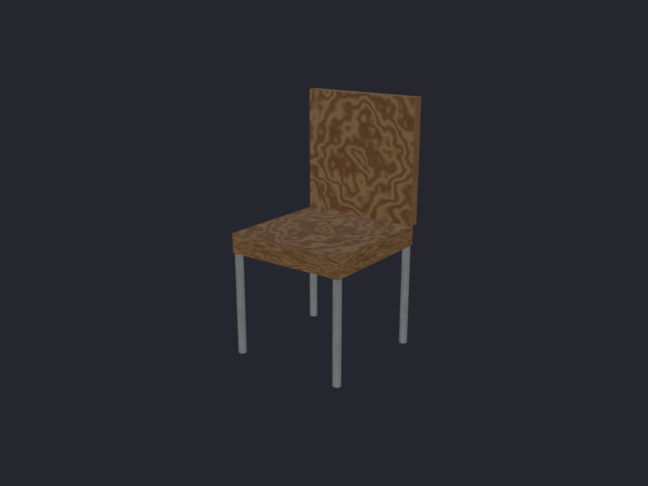
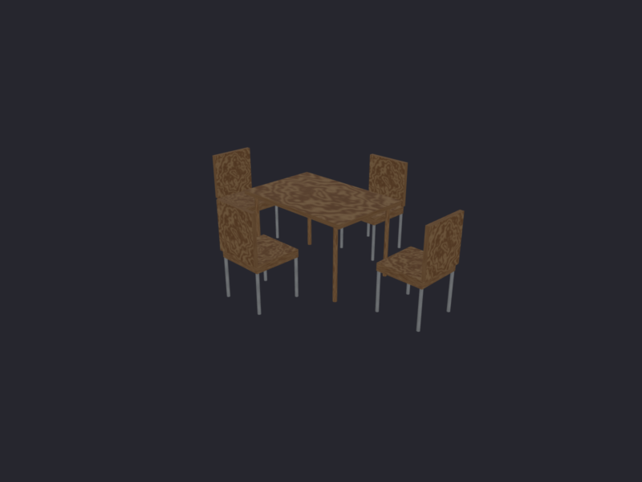
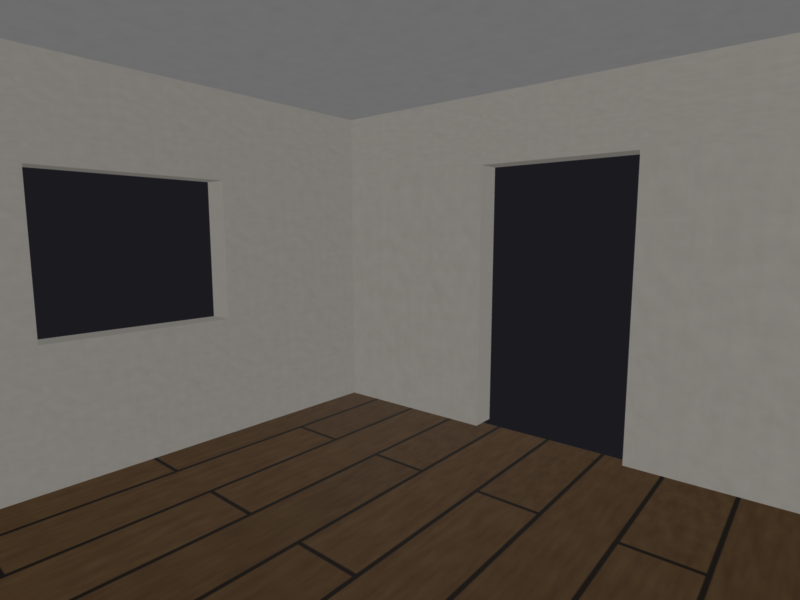
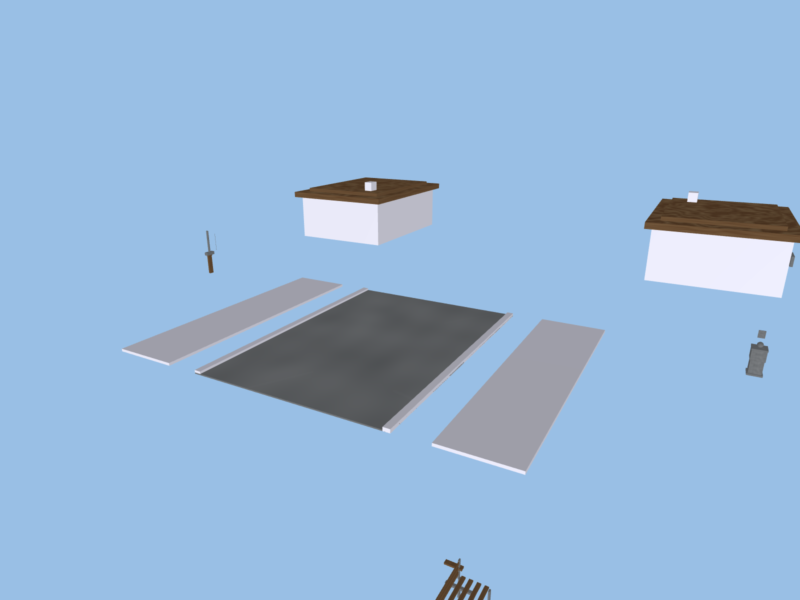

# Geogen

Procedural 3D geometry generator for game assets. Provides a scene graph system with hierarchical transformations, primitive mesh generators, procedural textures, and PBR materials.

## Examples

**Chair** - Simple composite object with wood texture and metal legs:



**Dining Set** - Table with four chairs attached via attachment points:



**Room** - Room with walls, floor, ceiling, door and window openings:



**Street Scene** - Road with house plots on both sides + street furniture:



## Installation

```bash
pip install -e .

# With dev dependencies
pip install -e ".[dev]"
```

## Usage

```bash
# Open interactive viewer
python -m geogen.main

# Select a specific scene
python -m geogen.main -s dining_set

# Render to file
python -m geogen.main -s room -r output.png --resolution 1920x1080
```

Available scenes: `chair`, `table`, `dining_set`, `room`, `street`

## Defining Assets

Assets are defined in YAML files. A simple object uses primitives positioned with anchors:

```yaml
name: table
origin: bottom_center
size: [1.2, 0.75, 0.8]

parts:
  top:
    primitive: cube
    size: [1.0, 0.05, 1.0]
    anchor: bottom_center
    offset: [0, 0.95, 0]
    material: wood

  leg_front_left:
    primitive: cylinder
    size: [0.05, 0.95, 0.05]
    anchor: bottom_front_left
    offset: [0.08, 0, -0.08]
    material: wood
```

Composite scenes attach objects together:

```yaml
name: dining_set

compose:
  table:
    asset: table.yaml

  chairs:
    asset: chair.yaml
    attach_to: table
    at: [seat_front, seat_back, seat_left, seat_right]
```

## Architecture

- **Core** (`src/geogen/core/`): SceneNode hierarchy, Mesh, Transform
- **Generators** (`src/geogen/generators/`): Primitives (Cube, Sphere, Cylinder, Cone), RoomGenerator
- **Textures** (`src/geogen/textures/`): Procedural texture generators (wood, metal, floor, wall)
- **Materials** (`src/geogen/materials/`): PBR material system with texture caching
- **Layout** (`src/geogen/layout/`): Anchor-based positioning and attachment points
- **Lighting** (`src/geogen/lighting/`): Directional and point lights
- **Viewer** (`src/geogen/viewer/`): PyQt6/OpenGL viewer with PBR shaders

## Running Tests

```bash
pytest
```

## License

MIT
