# Geogen

Procedural 3D geometry generator for game assets. You describe objects and scenes in YAML (parts, profiles, cut-outs, roofs, materials, anchors) and geogen builds watertight, UV-mapped meshes with procedural PBR textures. It renders them, shows them in an interactive viewer, exports them to glTF/OBJ, and runs them in a Godot 4 runtime that you can walk around in first person.

The goal is nested, generated worlds: cities that contain neighbourhoods that contain streets, houses and furnished rooms. A small version of that works today: a town district of generated shops, houses, offices, an apartment block and a hotel, with furnished interiors you can walk into in Godot.

## Examples

**Town**: a `city:` scene. It has a street grid with an avenue and sidewalks, zoned lots and street furniture. Buildings are generated to fit their lots:
- shop rows with flats above along the avenue;
- houses on the side streets;
- a hotel and an apartment block as landmarks;
- a park.

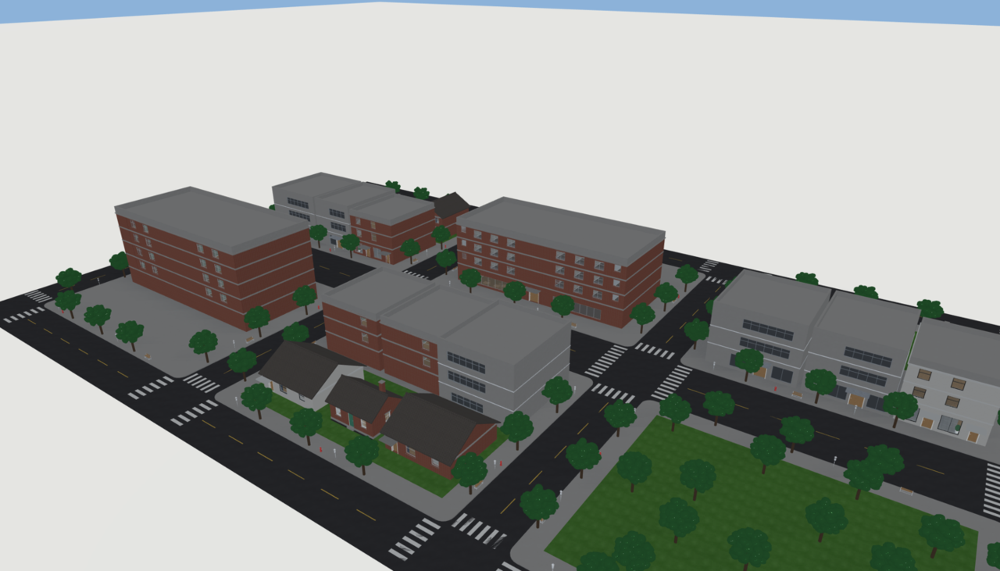

**Walking the town in Godot**: the district streams in chunks around the player (left). Buildings have furnished interiors, like the hotel lobby (right):

| Streamed street | Hotel lobby |
|---|---|
| 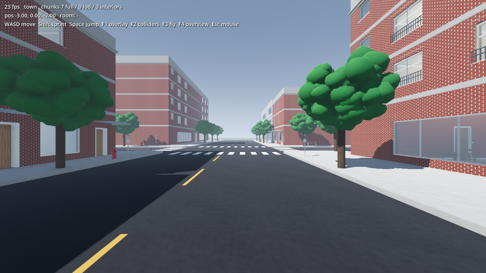 | 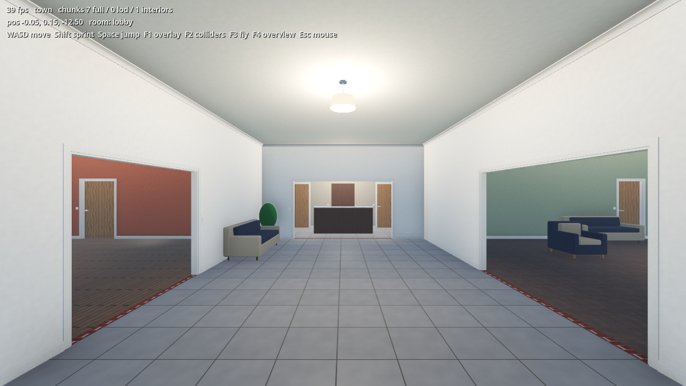 |

**Hotel**: a multi-storey building generated from floor-plan layouts: a lobby floor, guest floors, scissor stairs, a working lift, a façade and a roof (left). A guest room furnished by the furnishing solver, shown with the ceiling cut away (right):

| Hotel | Furnished room (cutaway) |
|---|---|
| 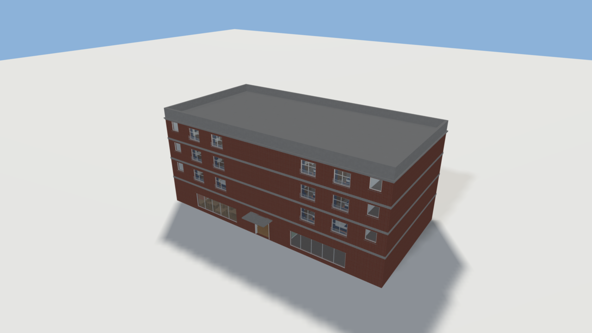 | 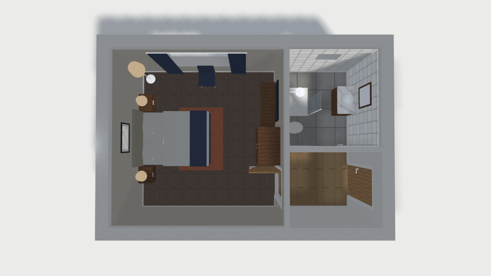 |

**Park**: seeded scatter placement of space-colonisation trees and displaced rocks around a cottage and a lamp-lit path:

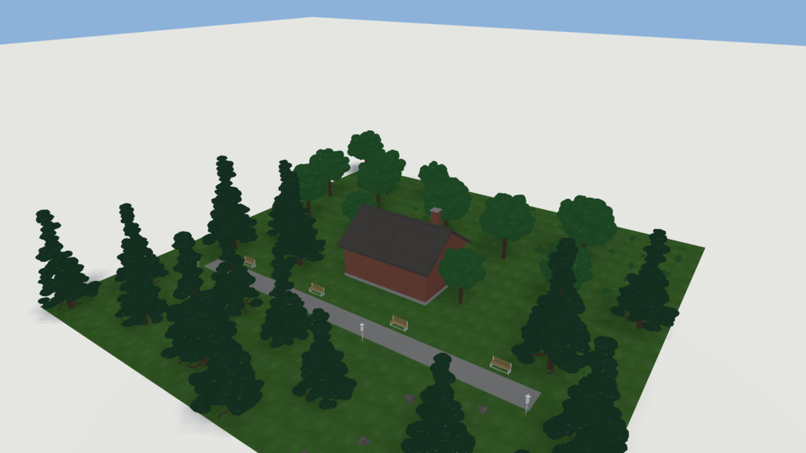

**Street**: a composed scene. Each side of the road is a nested `street_side` scene whose house plots place cottages, and the lamps, trees, hydrant and bench are placed in named slots.

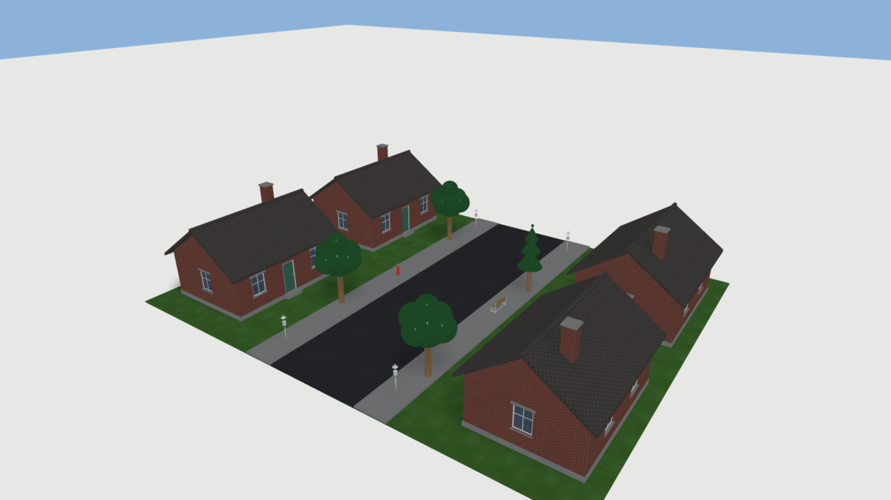

**Cottage**: a hollow brick shell with a gable roof and chimney. The door and windows each cut their own opening into the wall they're placed on. Contact sheet from `--views` (iso, front, side, top):

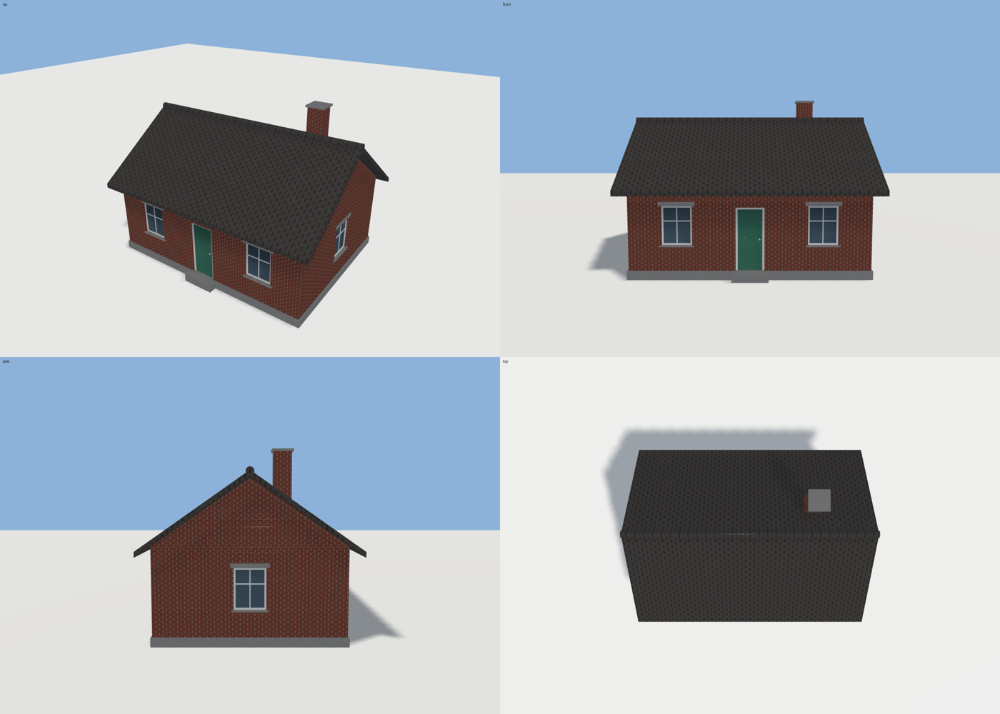

**Dining set**: turned (`lathe`) legs and spindles, a rounded (`extrude`) tabletop, and four chairs attached to the table's `seat_*` attachment points:

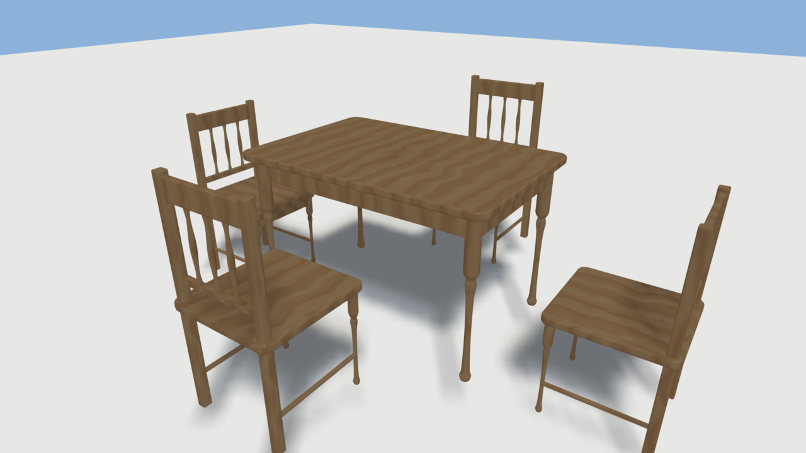

| Chair | Room |
|---|---|
| 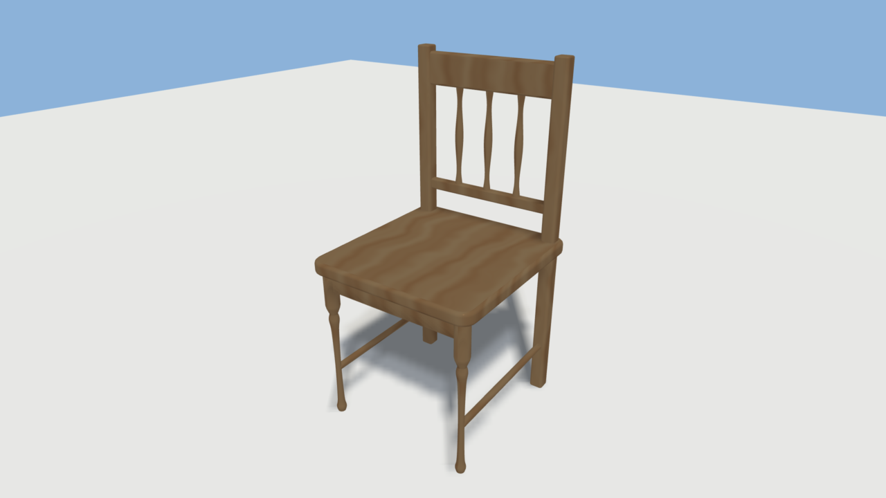 | 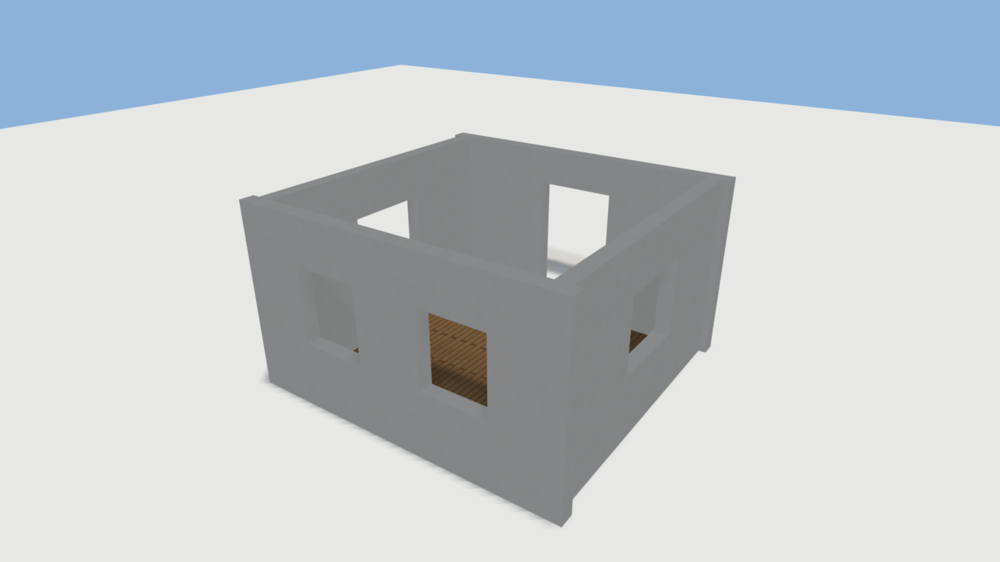 |

**Godot runtime**: the cottage exported with `--export-godot` and walked in first person (left); F2 shows the collision shapes (right):

| First person | Collider wireframes |
|---|---|
| 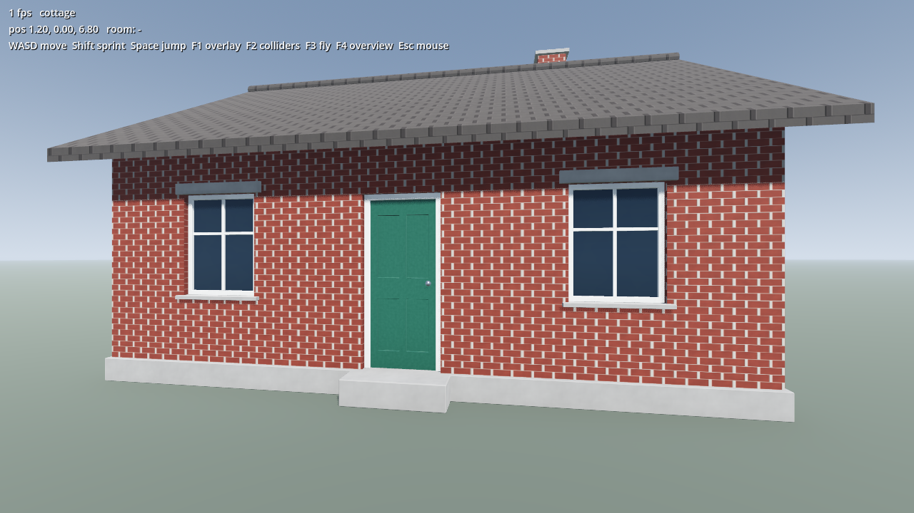 | 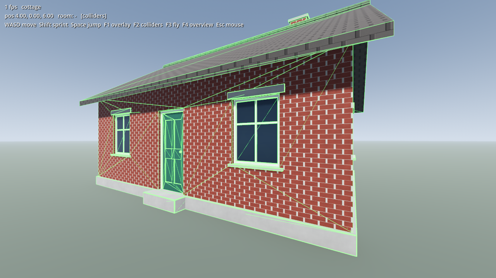 |

**Interactive viewer** (Qt/OpenGL) viewport: shadows, PBR, grid, picking:

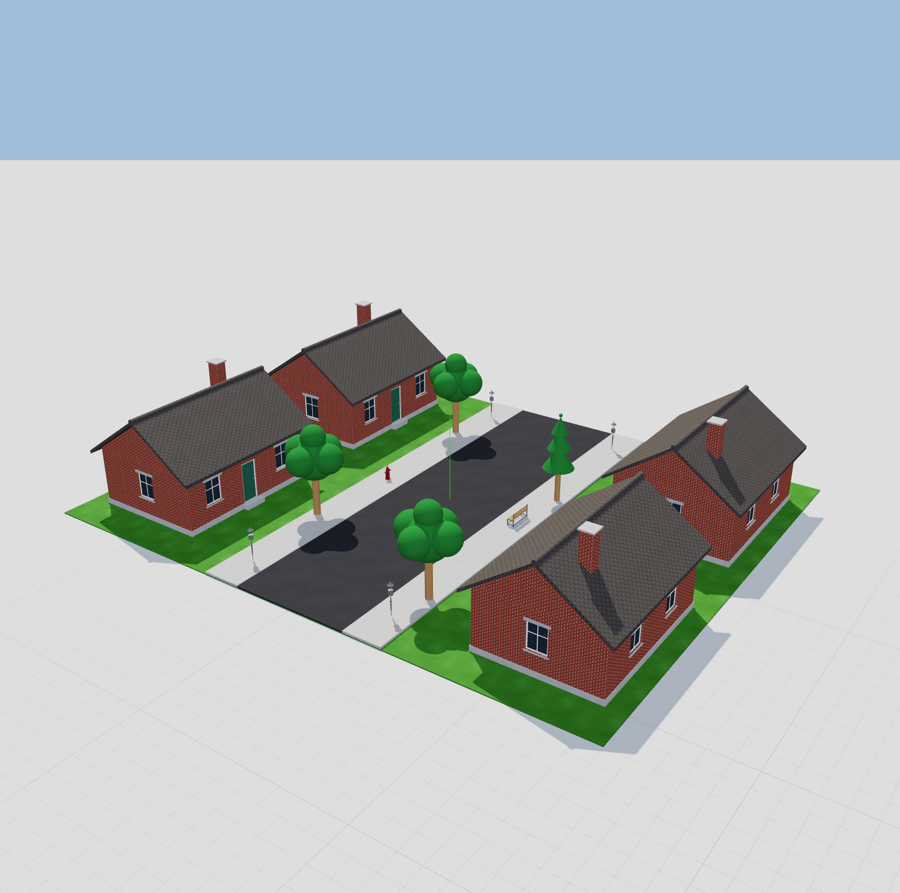

## Features

- **YAML assets and scenes**: parts positioned by anchors or attached to each other by named points; `{expr}` parameters (`"{width / 2}"`, `50cm`); scenes compose assets and other scenes through slots, attachments and surfaces (`on: house.front_wall`), and can scatter seeded copies (`scatter:`).
- **Geometry**:
  - rounded boxes, cylinders, spheres, capsules and tori;
  - `extrude`, `lathe` and `sweep` profiles;
  - stairs, and gable/hip/shed/flat roofs;
  - Loop subdivision and noise displacement (`subdivide:`, `displace:`);
  - space-colonisation `tree`s and displaced `rock`s;
  - CSG (`subtract:`, and `cut_host:` so windows and doors cut their own openings).
- **Buildings**:
  - multi-room floor plans, with walls, doors and windows generated from room rectangles;
  - multi-storey buildings with stair cores, lifts, façades and roofs;
  - interior finishes (linings, skirting, cornices, lights and switches).
- **Furnishing**: room archetypes (bedroom, bathroom, lobby, office, shop, ...) furnish rooms automatically. Layout QA checks for overlaps, blocked door swings and windows, doors too narrow for the player, unreachable furniture and z-fighting surfaces.
- **Interactions**: doors, drawers, switches, TVs and lifts are declarative state machines, with locks, keys, auto-close and seats (sit / lie). They're exported as extras and as glTF animations.
- **Cities**:
  - a street grid with blocks and lots;
  - zoning: commercial along avenues, residential elsewhere, landmark blocks and parks;
  - building recipes sized to each lot (houses, shop rows, apartments, offices, hotels), with full, lobby-only or shell interiors;
  - street furniture.
- **Scale**: instanced meshes, shared glTF meshes, an on-disk generation cache, LODs (`MSFT_lod`) and chunked export with exterior LODs and per-building interiors.
- **Quality checks**:
  - Meshes are closed and consistently wound; `meshops.validate` checks them, and a test runs it on every asset.
  - UVs are metric (1 unit = 1 m), so texture density doesn't depend on object size.
  - Every scene must pass layout QA, including the z-fighting check.
- **Procedural PBR materials**: wood, bark, metal, brick, concrete, asphalt, roof shingles, grass, rock, fabric, carpet, tile, marble, glass, emissive shades and more, with base colour, normal, roughness and AO maps. Every texture tiles seamlessly. Meshes can carry several materials (one glTF primitive each) and vertex colours.
- **Viewer**:
  - scene list, node tree and inspector (sizes, triangle counts, materials, surfaces, interactions, validation, layout check);
  - lit/clay/normals/UV-checker display modes;
  - cutaway, storey and interaction-state sections, and night lighting;
  - hot reload of `assets/**/*.yaml`.
- **Rendering**: offscreen rendering with shadows and PBR, auto-framed, view presets, cutaways, and multi-view contact sheets.
- **Export**: glTF/GLB with the node hierarchy, PBR textures, colliders (Godot import suffixes), gameplay extras (a versioned JSON schema), punctual lights, interaction animations and a JSON manifest; or OBJ+MTL+PNG.
- **Player spec**: one file (`assets/player.yaml`) defines the player's size (radius, height, eye and step height, max slope, minimum door and corridor clearances, reach). Generation and the runtime both read it, so "enterable" means the same thing on both sides.
- **Godot 4 runtime** (`runtime/godot/`):
  - a first-person player sized from the manifest, with step-up, collision, fly mode and a debug overlay;
  - interactions (E to use, L to lock), seats, light switches, save/load and live reload;
  - an automated playtest that checks every room is reachable;
  - chunk streaming (full, LOD and interiors) with navmesh tiles baked around the player.

## Installation

Requires Python 3.10+.

```bash
python -m venv .venv && source .venv/bin/activate
pip install -e ".[dev]"
```

For the runtime, install [Godot 4.7](https://godotengine.org/download). The tests look for `godot`/`godot4` on `PATH`, then `$GODOT`, then `/Applications/Godot.app`.

## Usage

Every YAML file in `assets/` and `assets/scenes/` is a scene you can pass to `-s` (for example `chair`, `dining_set`, `cottage`, `street`, `hotel`, `hotel_room_auto`, `park`, `town`), plus the Python-coded `nature` scene. Run `python -m geogen.main --help` for the full list.

```bash
# Interactive viewer
python -m geogen.main -s dining_set

# Render to a PNG and quit (shadows, PBR, auto-framed)
python -m geogen.main -s room -r out.png --resolution 1280x720
python -m geogen.main -s chair -r out.png --view side --zoom 1.5 --no-ground
python -m geogen.main -s cottage -r sheet.png --views                  # iso/front/side/top
python -m geogen.main -s cottage -r sheet.png --views iso,back,top
python -m geogen.main -s hotel_room_auto -r out.png --cutaway          # hide ceilings/roofs to see inside

# Screenshot the interactive viewer (display: lit | clay | normals | uv)
python -m geogen.main -s street --viewer-screenshot shot.png --display uv

# Export for game engines
python -m geogen.main -s dining_set -e out/dining_set.glb              # .glb / .gltf / .obj
python -m geogen.main -s hotel -e out/hotel.glb --lods 0.5,0.25        # with decimated LODs
python -m geogen.main -s town --chunks out/town_chunks --cache         # streamable chunks; cache generated assets
```

### Walking a scene in Godot

```bash
python -m geogen.main -s cottage --export-godot                        # -> runtime/godot/generated/
godot --path runtime/godot -- --scene cottage
```

You spawn at the scene's spawn point (or in front of the model). The controls are:
- WASD moves, Shift sprints, Space jumps, and the mouse looks around (click to capture it, Esc to release).
- E uses what you're looking at (doors, drawers, switches, the lift) or sits/lies on furniture, and L locks or unlocks a door you hold the key for.
- F1 toggles the overlay, F2 the collider wireframes, F3 fly mode, and F4 an overview camera.

If you re-export while the game is running, it reloads the model within half a second.

Large scenes stream: the runtime loads nearby blocks in full, distant ones as LODs, and building interiors as you approach them, and bakes navigation tiles around you.

```bash
python -m geogen.main -s town --export-godot --stream                 # -> runtime/godot/generated/town_chunks/
godot --path runtime/godot -- --scene town --stream
```

To check that a building is enterable, export it (`-s hotel --export-godot`) and run `godot --headless --fixed-fps 60 --path runtime/godot -- --scene hotel --playtest`. It reports any rooms or interaction targets the player can't reach from the spawn. See [`runtime/godot/README.md`](runtime/godot/README.md) for all the runtime's options and the manifest and chunk index formats.

## Defining assets

An asset is a set of parts in a container of `size` metres, with its origin at the bottom centre. Parts are positioned by `anchor` + `offset` (as fractions of the container) or attached to another part with `attach_to`/`at`/`from`. Parameters can be overridden from code with `LayoutLoader().load(path, params={...})`.

```yaml
name: table
origin: bottom_center

params:
  width:  { default: 1.2 }
  height: { default: 0.75 }
  depth:  { default: 0.8 }
  top_thickness: { default: 0.035 }

size: ["{width}", "{height}", "{depth}"]

parts:
  top:                                   # rounded slab: 2D shape extruded along Y
    primitive: extrude
    shape: { rect: ["{width}", "{depth}"], radius: 0.05 }
    fit: none                            # shape is in metres
    axis: y
    bevel: 0.008
    size: [1.0, "{top_thickness / height}", 1.0]
    anchor: bottom_center
    offset: [0, "{1 - top_thickness / height}", 0]
    material: wood

  leg_front_left:                        # turned leg: (radius, height) profile revolved around Y
    primitive: lathe
    profile: { spline: [[0.62, 0.0], [0.42, 0.3], [0.72, 0.6], [1.0, 1.0]] }
    size: [0.05, "{1 - top_thickness / height}", 0.075]
    anchor: bottom_front_left
    offset: [0.08, 0, -0.08]
    material: wood

attachments:                             # where other objects can attach
  seat_front:
    anchor: bottom_front_center
    offset: [0, 0, 0.4]
    facing: center
```

Buildings use CSG and architectural primitives:

```yaml
parts:
  walls:
    primitive: cube
    subtract: [interior]                 # hollow shell
    material: brick
  interior: { primitive: cube, cutter: true, ... }
  roof:
    primitive: roof
    style: gable                         # gable | hip | shed | flat
    overhang: 0.4
    material: roof_shingle

surfaces:                                # 2D regions other objects can be placed on
  front_wall: { from: walls.front }
```

### Composing scenes

Scenes place assets (and other scenes) using slots, attachment points or surfaces:

```yaml
name: cottage
place:
  house:
    asset: house_peaked.yaml
  door:
    asset: door.yaml
    on: house.front_wall                 # cuts its own opening into the wall
    at: { u: 0.5, v: { abs: 0 } }
  window_front_left:
    asset: window.yaml
    on: house.front_wall
    at: { u: 0.2, v: { abs: 0.85 } }
```

```yaml
name: dining_set
place:
  table:
    asset: table.yaml
  chairs:
    asset: chair.yaml
    attach_to: table
    at: [seat_front, seat_back, seat_left, seat_right]   # one chair per attachment point
```

A district is a `city:` block. Buildings come from recipes generated to fit each lot:

```yaml
name: town
city:
  blocks: [3, 2]
  block_size: [44, 36]
  avenues: { ew: [1] }                   # the middle east-west street is an avenue
  landmarks: { "1,0": { recipe: hotel, storeys: 4, interior: lobby } }
  parks: ["2,1"]
  buildings:
    residential: [{ recipe: detached_house, storeys: [1, 2] }]
    commercial:  [{ recipe: shop_row, storeys: [2, 3], interior: lobby }]
  furniture:
    lamp: { asset: street_lamp.yaml, spacing: 20 }
    tree: { asset: maple_tree.yaml, spacing: 10 }
```

## Architecture

| Package | Contents |
|---|---|
| `core/` | `SceneNode` hierarchy (with instancing), `Mesh` (material groups, vertex colours), `Transform`; `meshops` (normals, welding, tangents, decimation, `validate`), `uvmap` (metric projections), `profile` (2D shapes), `csg` (manifold3d booleans), `subdiv` (Loop subdivision, displacement) |
| `generators/` | Primitives, profiles, sweeps, stairs, roofs, doors, floor plans and plan layouts, multi-storey buildings, façades, interior finishes, trees and rocks |
| `textures/`, `materials/` | Tiling procedural texture generators; PBR materials loaded from `assets/materials/*.yaml` with a metric `tile_size` |
| `layout/` | `LayoutLoader` (assets) and `SceneComposer` (scenes); anchors, attachments, surfaces, the `{expr}` evaluator; interactions, the furnishing solver, layout QA, scatter, city layout, building recipes, the prototype cache |
| `viewer/` | Qt window, OpenGL view (shadows, PBR, debug display modes, picking, sections, night mode), pure-numpy orbit camera |
| `render.py`, `export.py`, `chunks.py` | Offscreen pyrender renderer; glTF/GLB/OBJ export (colliders, extras, lights, LODs, animations) and the runtime manifest; chunked export |
| `player.py` | `PlayerSpec`, loaded from `assets/player.yaml` |
| `registry.py` | Discovers YAML assets/scenes and Python-coded scenes |
| `runtime/godot/` | Godot 4.7 project: runtime glTF loading, first-person player, interactions, playtest, chunk streaming |

[`CLAUDE.md`](CLAUDE.md) has the detailed design notes and conventions.

## Tests

```bash
pytest                                   # everything
pytest tests/test_scenes.py -k chair     # a subset
```

The tests cover assets, textures, exports and (when Godot is installed) the runtime:
- Every asset and scene's meshes are valid, and every scene passes layout QA (including the z-fighting check).
- Textures tile, and exports round-trip.
- The Godot runtime is run headless: the player walks into the cottage (the wall blocks, the door step is climbed, the closed door blocks), rides the hotel lift, and playtests the hotel from the street.
- In the streamed town, the tests walk the avenue into a shop and the hotel lobby.

The Godot tests are skipped when Godot isn't found.

To regenerate the screenshots in this README, run `docs/make_screenshots.sh`.

## License

MIT
